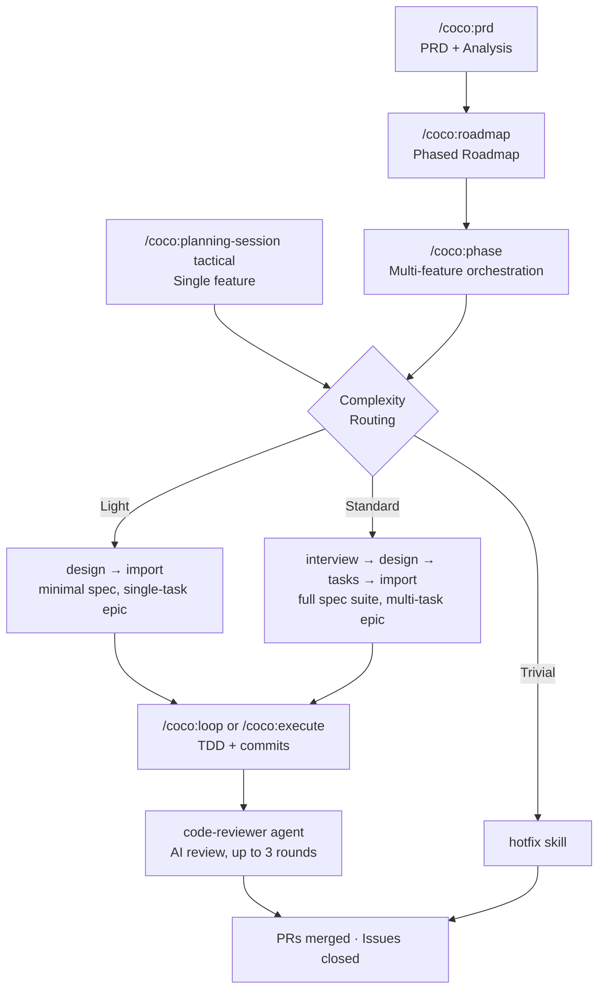

<p align="center">
  
</p>

<h1 align="center">Coco</h1>

<p align="center">
  <strong>Autonomous spec-driven development for Claude Code.</strong><br>
  Describe a feature. Get merged, tested, reviewed code.
</p>

<p align="center">
  <a href="#installation"></a>
  <a href="LICENSE"></a>
  <a href="#requirements"></a>
</p>

---

Named after **Coco**, a toy poodle who is small, fiercely opinionated, and relentlessly autonomous -- much like this plugin. She chases birds with the same energy Coco chases tasks through a dependency graph: methodically, loudly, and without asking for permission. When she's not barking at strangers or sneaking cheese, she's napping -- recharging for the next burst of chaotic productivity.

## Why Coco?

Most Claude Code workflows handle one slice of the problem. A spec generator here, a task tracker there, an autonomous loop somewhere else. You end up duct-taping three repos together and hoping they agree on file formats.

Coco is the whole pipeline in one plugin:

```
 Discover        Plan            Decompose       Execute        Review        Ship
───────── ──▶ ─────────── ──▶ ─────────── ──▶ ─────────── ──▶ ──────── ──▶ ──────
 PRD +          interview →     tasks.md +      TDD loop       AI code      PRs merged,
 Roadmap        design.md       tracker import  + commits      review       issues closed
```

**Zero dependencies** beyond bash and jq. No daemon. No database. No node_modules. Install from the marketplace and go.

## What You Get

- **Discovery to delivery** -- PRD, roadmap, design, tasks, implementation, review, merge. One plugin.
- **Dependency-aware execution** -- Built-in tracker with topological sort. `ready` always returns the next unblocked task.
- **Autonomous loop** -- Circuit breaker, progress detection, configurable safety limits. Runs until done or stuck. Supports worktree-based parallel execution.
- **AI code review** -- Every PR reviewed before merge. Critical findings auto-fixed. Up to 3 review iterations.
- **Adaptive routing** -- Quick fix? Skip the ceremony. Full feature? Full pipeline. Complexity detected automatically.
- **Session memory** -- Survives context compaction. Pick up where you left off across sessions.
- **Multi-repo support** -- Derive platform-specific PRDs from a primary repo. Each satellite runs its own independent pipeline.
- **Issue tracker sync** -- Linear, GitHub Issues, or neither. Config-driven, not hard-coded.

## Quick Start

### Install

In Claude Code, add the marketplace and install the plugin:

```
/plugin marketplace add skullninja/coco-workflow
/plugin install coco@coco-workflow
```

Then, in your project:

```
/coco:setup
```

The setup command creates the `.coco/` directory, walks you through key settings (project name, issue tracker, parallel execution), installs git hooks, and configures permissions.

### Build something

```bash
# Full pipeline: discovery to delivery
/coco:prd "My product description"       # Create PRD
/coco:roadmap v1.0                       # Prioritized roadmap
/coco:phase "Phase 1: Foundation"        # Orchestrate all features

# Single feature
/coco:planning-session tactical               # Interview -> design -> tasks -> import
/coco:loop                               # Autonomous execution until done

# Quick fix
# Just describe the bug -- hotfix skill handles it
```

### Check in on progress

```bash
/coco:standup                            # What happened, what's next, what's stuck
/coco:status                             # Execution state and parallel opportunities
```

## How It Works

### Architecture

| Layer | What | How |
|-------|------|-----|
| **Discovery** | PRD, analysis, roadmap, multi-repo derive | `/coco:prd`, `/coco:roadmap` |
| **Planning** | Discovery, design, task decomposition | AI-selected skills (`interview`, `design`, `tasks`, `import`) |
| **Execution** | Dependency resolution, TDD loop | Built-in tracker + `/coco:loop` |
| **Review** | AI code review on every PR | `code-reviewer` agent |
| **Visibility** | Issue tracker sync | Linear MCP, GitHub CLI, or none |

### Adaptive Complexity Routing

Not every change needs the full pipeline. `/coco:planning-session tactical` and `/coco:phase` automatically right-size the workflow:

| Tier | Signal | What Runs |
|------|--------|-----------|
| **Trivial** | Single file, bug fix, "quick" | `hotfix` -- no epic, no ceremony |
| **Light** | 1-3 files, single story | Design + import -- skip task decomposition |
| **Standard** | Multi-file, dependencies | Full pipeline -- interview, design, tasks, import |

### Autonomous Loop

`/coco:loop` wraps TDD + PR + review in an autonomous loop:

- **Circuit breaker** -- Pauses after consecutive iterations with no progress
- **Safety limit** -- Configurable max iterations (default: 20)
- **Error pause** -- Stops on test/build failures
- **Progress tracking** -- Measured by git commits, not just status changes
- **Feature PR** -- Auto-creates and reviews the feature-to-main PR on completion

### PR Workflow

Two-tier branching with AI code review:

```
main
  +-- feature/{name}                    # one per epic
  |     +-- feature/{name}/{ISSUE-1}    # one per task, PR -> feature branch
  |     +-- ...
  +-- PR: feature/{name} -> main        # after all tasks done, AI-reviewed
```

Every PR gets reviewed. Critical findings are auto-fixed and re-reviewed (up to 3 rounds). Set `pr.enabled: false` to skip PRs entirely.

### Built-In Task Tracker

The tracker (`lib/tracker.sh`) is ~480 lines of bash + jq. No external tools.

- **Dependency graphs** with topological sort
- **Epic management** for grouping tasks into features
- **Session memory** across Claude Code sessions
- **Metadata storage** for issue keys, file ownership, custom data
- **Git sync** for committing tracker state

### Hooks

Event-driven automation via Claude Code hooks:

| Hook | Trigger | What It Does |
|------|---------|--------------|
| **post-tool-use** | After `Write`/`Edit` | Runs lint + typecheck against modified file |
| **pre-compact** | Before compaction | Saves session state so you don't lose context |
| **session-start** | New session | Restores context from previous session |

Configure quality checks in `.coco/config.yaml`:

```yaml
quality:
  lint_command: "ruff check {file}"      # or eslint, biome, etc.
  typecheck_command: "mypy {file}"       # or tsc --noEmit, etc.
  auto_fix: false
```

## Commands and Skills

### Commands (13)

Human-facing entry points. These show up in `/` autocomplete.

| Command | Purpose |
|---------|---------|
| `/coco:setup` | Initialize Coco in the current project (config, hooks, permissions) |
| `/coco:prd` | Create, audit, or derive Product Requirements Document |
| `/coco:roadmap` | Build prioritized, phased roadmap from PRD + analysis |
| `/coco:phase` | Orchestrate full pipeline for a roadmap phase |
| `/coco:loop` | Autonomous execution loop with circuit breaker |
| `/coco:execute` | TDD execution loop (one task at a time) |
| `/coco:constitution` | Manage project constitution (guiding principles) |
| `/coco:dashboard` | Compact visual progress dashboard |
| `/coco:status` | Execution state and parallel opportunities |
| `/coco:standup` | Daily standup -- done, in-progress, blocked, metrics |
| `/coco:sync` | Reconcile tracker with issue tracker |
| `/coco:planning-session` | Guided planning (strategic / tactical / operational) |
| `/coco:planning-triage` | Score and disposition bugs, features, feedback |

### Skills (6)

AI-selected workflow steps. These run automatically as part of the pipeline -- you don't invoke them directly.

| Skill | Purpose |
|-------|---------|
| `interview` | Pre-design discovery interview producing structured brief |
| `design` | Feature design (spec + plan) with optional clarification (supports light mode) |
| `tasks` | Dependency-ordered task list with 6-pass consistency analysis |
| `import` | Import to tracker + issue tracker (supports design-only mode) |
| `hotfix` | Single-issue fix -- no epic, no ceremony |
| `execute` | Delegates to /coco:execute command |

## Issue Tracker Integration

| Provider | Integration |
|----------|------------|
| **Linear** | Via Linear MCP -- projects, issues, comments, status updates |
| **GitHub** | Via `gh` CLI -- issues + GitHub Projects V2 boards for visual status tracking |
| **None** | Tracker-only. No external calls. |

All config-driven. Status mappings, team names, labels, issue key formats -- everything lives in `.coco/config.yaml`.

**GitHub Projects V2**: When `use_projects: true` (default), creates a project board per feature with status columns (Todo, In Progress, In Review, Done). Issues move between columns automatically as tasks progress. Set `use_projects: false` for label-based tracking.

## Installation

### Requirements

- [Claude Code](https://docs.anthropic.com/en/docs/claude-code)
- `jq`
- `git`
- `gh` (GitHub CLI -- optional, only needed if `pr.enabled: true`)

### Setup

In Claude Code:

```
/plugin marketplace add skullninja/coco-workflow
/plugin install coco@coco-workflow
```

In your project:

```
/coco:setup
```

The setup wizard walks through project name, issue tracker, and parallel execution settings, creates the `.coco/` directory, and installs git hooks.

For existing projects, run `/coco:prd audit` after setup to generate a PRD from your codebase. For satellite repos in a multi-repo project, run `/coco:prd derive /path/to/primary/docs/prd.md` to create a platform-specific PRD.

### Project Structure

```
coco-workflow/                          # This repo (Claude Code plugin)
  .claude-plugin/plugin.json            # Plugin manifest
  .claude-plugin/marketplace.json       # Marketplace manifest
  commands/                             # 13 slash commands
  skills/                               # 6 AI-selected skills (interview, design, tasks, import, hotfix, execute)
  agents/                               # 3 agents (code-reviewer, task-executor, pre-commit-tester)
  hooks/hooks.json                      # Claude Code hooks (quality, session memory, bash guards)
  git-hooks/                            # Git hooks (commit-msg, pre-commit)
  lib/tracker.sh                        # Built-in task tracker
  templates/                            # Default templates
  config/coco.default.yaml              # Default configuration

your-project/
  .coco/
    config.yaml                         # Your project configuration
    memory/constitution.md              # Project principles
    templates/                          # Template overrides
    tasks/                              # Tracker state (JSONL)
  docs/
    prd.md                              # Product Requirements Document
    analysis/                           # Analysis documents
    roadmap/                            # Roadmap documents
  specs/{feature}/                      # Spec artifacts per feature
```

## Configuration

Copy and customize `config/coco.default.yaml` to `.coco/config.yaml`:

```yaml
project:
  name: "My Project"
  specs_dir: "specs"

discovery:
  prd_path: "docs/prd.md"
  analysis_dir: "docs/analysis"
  roadmap_dir: "docs/roadmap"
  source_prd: ""               # Path to source PRD (for derived/satellite repos)

issue_tracker:
  provider: "none"                # linear | github | none

quality:
  lint_command: ""                # e.g., "ruff check {file}"
  typecheck_command: ""           # e.g., "mypy {file}"
  auto_fix: false

commit:
  title_format: "{description}. Completes {issue_key}"

loop:
  max_iterations: 20
  no_progress_threshold: 3
  pause_on_error: true
  parallel:
    enabled: false              # Enable worktree-based parallel execution
    max_agents: 3

pr:
  enabled: true
  issue_merge_strategy: "squash"
  feature_merge_strategy: "merge"
  review:
    enabled: true
    max_review_iterations: 3
```

See [`config/coco.default.yaml`](config/coco.default.yaml) for all options.

## Pipeline



## Acknowledgments

Built on ideas from:

- **[Ralph](https://github.com/snarktank/ralph)** and **[ralph-claude-code](https://github.com/frankbria/ralph-claude-code)** -- Autonomous loop pattern with circuit breaker
- **[Choo Choo Ralph](https://github.com/mj-meyer/choo-choo-ralph)** -- Combining structured task tracking with autonomous execution
- **[Beads](https://github.com/daveio/beads)** -- Git-native task tracker with dependency-aware selection
- **[Spec-Kit](https://github.com/daveio/spec-kit)** -- Spec-driven planning commands for Claude Code

## License

[MIT](LICENSE)
